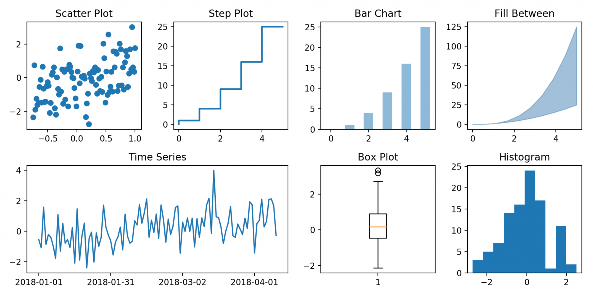

## Introduction

🚀 **Have fun and learn Python, Data Science, and Machine Learning by benchmarking popular libraries!**

This project lets you:

📊 Experiment with **`pandas`**,  
🔢 Dive into **`numpy`** arrays,  
📈 Visualize with **`matplotlib`**,  
⚙️ Compare performance of different techniques,  
🧠 Explore how these tools behave in practice!

💡 Great for learning, practicing, and satisfying your curiosity while becoming a better data scientist.

---





## Statistics


- **Total Benchmarks:** 12
- **Libraries Covered:** pandas, numpy, matplotlib
- **Latest Addition:** [Matrix Multiplication Benchmark](benchmarks/numpy/np_matrix_multiplication.py)


## Running Benchmarks with Python


**To run a benchmark:**
1. Install dependencies:
    ```bash
    pip install pandas numpy matplotlib
    ```
2. Run a benchmark script from the terminal, for example:
    ```bash
    python benchmarks/numpy/np_matrix_multiplication.py
    ```

## Using Jupyter Notebooks

You can run and explore benchmarks interactively using Jupyter Notebook (`.ipynb` files). Each tool folder contains notebook versions of the benchmarks for easy experimentation and visualization.

**To get started:**
1. Install Jupyter: `pip install notebook`
2. Open a terminal and run: `jupyter notebook`
3. Navigate to the desired folder (e.g., `benchmarks/pandas/`) and open any `.ipynb` file.

## Folder Structure

```
benchmarks/
     pandas/
          pd_py_matrix.py
          pd_py_matrix.ipynb
          ...
     numpy/
          np_matrix_multiplication.py
          np_matrix_multiplication.ipynb
          ...
     matplotlib/
          mpl_plot_benchmark.py
          mpl_plot_benchmark.ipynb
          ...
     plots/
          pd_py_matrix_bar_plot.png
          ...

README.md
```

- `README.md`: This guide and instructions.
- `benchmarks/`: Contains folders for each library (e.g., `pandas/`, `numpy/`, `matplotlib`).
     - Each library folder includes both Python modules (`.py`) and Jupyter notebooks (`.ipynb`) for benchmarking.


## Contributing

Contributions are welcome! Please open issues or submit pull requests for new benchmarks, improvements, or bug fixes. Make sure your code is well-documented and follows the existing structure.

## License

This project is licensed under the MIT License. See the [LICENSE](LICENSE) file for details.
